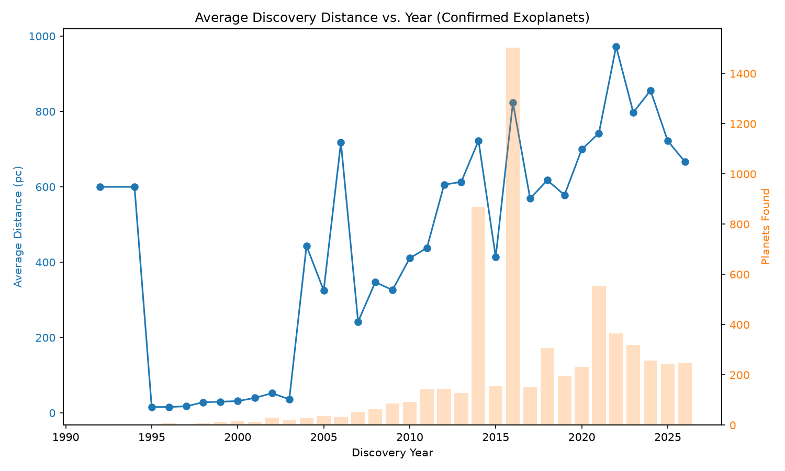

# Exoplanet Database Explorer

A PostgreSQL database of real confirmed exoplanet data from the NASA Exoplanet
Archive, with analytical SQL queries answering genuine astronomy questions,
plus a Python/pandas script for visualizing trends.

## Data source

[NASA Exoplanet Archive](https://exoplanetarchive.ipac.caltech.edu) —
*Planetary Systems Composite Parameters* (`pscomppars`) table, the current
maintained table of ~6,300 confirmed exoplanets (as of download date).

## Schema

Table `exoplanets_full` in a PostgreSQL database named `astronomy`:

| Column | Type | Description |
|---|---|---|
| `pl_name` | VARCHAR(100) PK | Planet name |
| `hostname` | VARCHAR(100) | Host star name |
| `discoverymethod` | VARCHAR(50) | Detection method (Transit, RV, etc.) |
| `disc_year` | INTEGER | Year of discovery |
| `pl_controv_flag` | SMALLINT | 0/1 controversial-detection flag |
| `pl_orbper`, `pl_orbpererr1`, `pl_orbpererr2`, `pl_orbperlim` | NUMERIC/SMALLINT | Orbital period (days) + uncertainty + limit flag |
| `pl_rade`, `pl_radeerr1`, `pl_radeerr2`, `pl_radelim` | NUMERIC/SMALLINT | Planet radius (Earth radii) + uncertainty + limit flag |
| `sy_dist`, `sy_disterr1`, `sy_disterr2` | NUMERIC | System distance (parsecs) + uncertainty |

## Analytical queries

- Which detection method has found the most planets?
- How has the leading detection method changed over time? (Radial Velocity → Transit, coinciding with Kepler's 2009 launch)
- What's the size distribution of confirmed planets? (Reveals detection bias toward large planets)
- Which stars host the most confirmed planets? (Surfaces known systems like Kepler-90/KOI-351 and TRAPPIST-1)
- How has the average discovery distance changed over time?

See `queries.sql` for the full query set.

## Findings

- **Detection method shifted over time.** Radial Velocity dominated
  discoveries through the early 2000s, but Transit photometry overtook it
  after Kepler's 2009 launch and now accounts for the large majority of
  confirmed planets (4,676 of ~6,300).
- **Confirmed planets skew large.** Neptune-sized and Jupiter-sized planets
  outnumber Earth-sized ones by roughly 4:1 — not because small planets are
  rarer in the galaxy, but because Transit and Radial Velocity are both far
  more sensitive to large planets, which block more light / cause bigger
  stellar wobbles.
- **Known multi-planet systems show up correctly.** The query for
  planets-per-star surfaces KOI-351 (Kepler-90, 8 planets) and TRAPPIST-1
  (7 planets) at the top — a useful sanity check that the data and queries
  are behaving as expected.
- **Discovery distance tracks survey history.** Early Radial Velocity-era
  planets (1995–2003) cluster within ~50 pc, since RV only works on bright,
  nearby stars. A large batch of Kepler-confirmed planets (~2016) sits much
  farther out (~800 pc), reflecting Kepler's single distant field of view.
  TESS-era planets (2018+) hold a similarly high, steady distance with more
  consistent year-to-year counts.



## Python / visualization

Three scripts, all following the same pattern: connect via SQLAlchemy,
pull a query into a pandas DataFrame, plot with matplotlib.

- `distance_trend.py` — average discovery distance per year,
  with planet count per year as context bars
- `detection_methods.py` — bar chart of planet count by
  detection method
- `size_distribution.py` — bar chart of planet count by size
  category (Earth-sized / Super-Earth / Neptune-sized / Jupiter-sized)

### Setup

```powershell
py -m pip install psycopg2-binary sqlalchemy pandas matplotlib
$env:ASTRONOMY_DB_PASSWORD = "your_postgres_password"
py exoplanet_distance_trend.py
py exoplanet_detection_methods.py
py exoplanet_size_distribution.py
```

## Tools used

PostgreSQL 18, pgAdmin 4, Python (pandas, SQLAlchemy, matplotlib)
